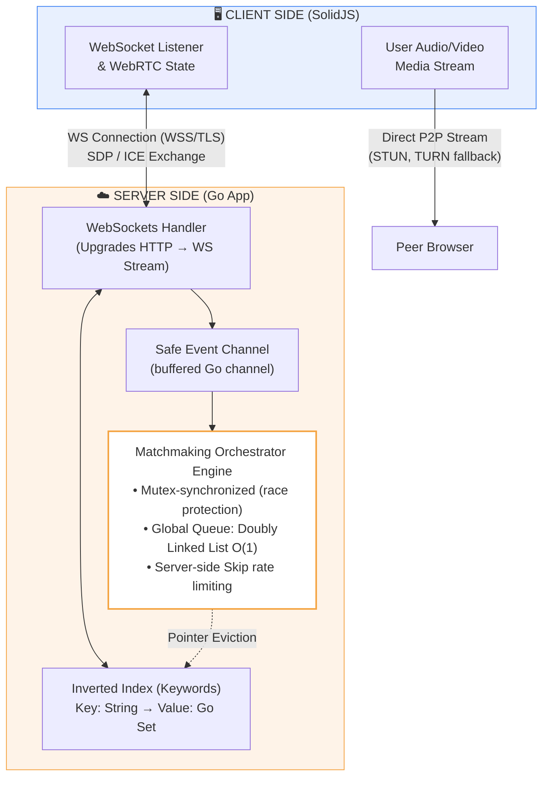
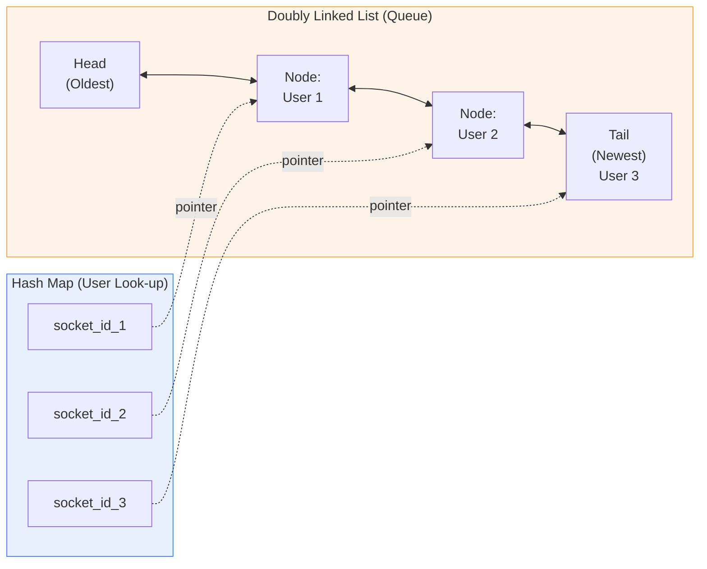
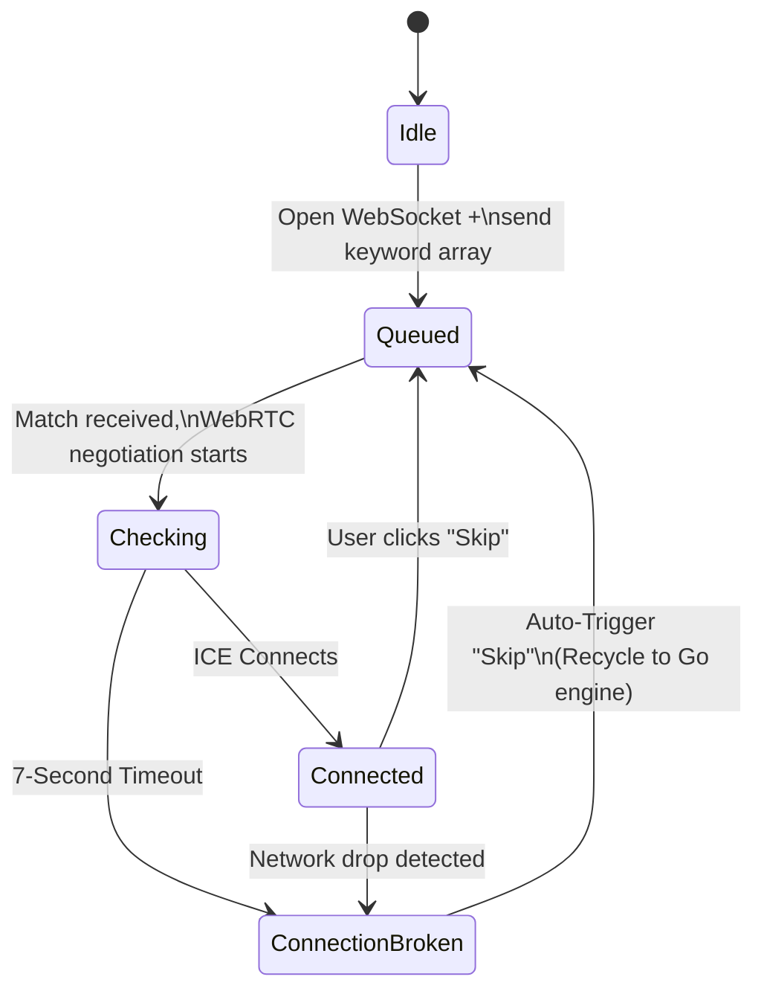
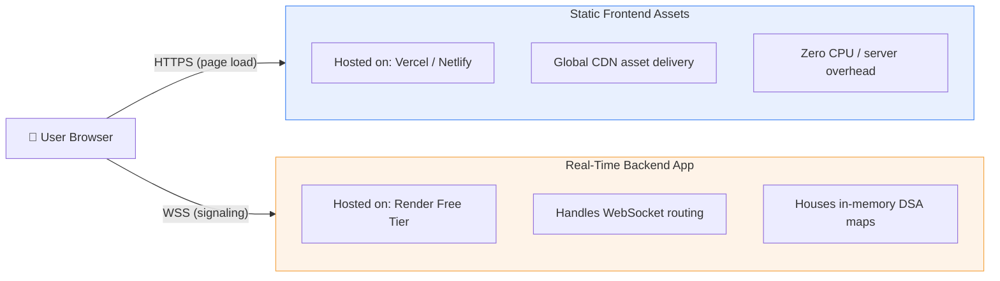

# Random Video Chat Platform — System Architecture Plan

## Phase 1: High-Level System Architecture & Infrastructure

The core architectural approach is **Resource Conservation**. The system isolates all volatile real-time tracking, state monitoring, and connection matching inside the server's RAM, bypassing disk operations entirely for live user tracking to prevent database exhaustion.

### 1. Architectural Component Splitting

- **The In-Memory Layer (Render RAM):** Coordinates active user web connections, manages the matching queue, assigns logical rooms, and relays short-lived WebRTC signaling messages.
- **The Persistent Database Layer (Supabase Free Tier):** Used exclusively for non-volatile, transactional operations (e.g., querying blacklisted IP address hashes, logging abuse reports, tracking total aggregated visitor numbers).

### 2. Network Layout Boundaries

- **Signaling and Room Discovery:** Managed via a single Web-Service instance on Render.
- **Media Streaming Pipe:** Transmitted directly peer-to-peer (P2P) between user browsers. The hosting server does not process or view any video or audio data.
- **NAT Traversal:** Primary path uses Google's free public STUN infrastructure (`stun:stun.l.google.com:19302`). Because STUN alone fails for users behind symmetric NAT or restrictive corporate/school firewalls, a **TURN fallback** is included (see Phase 6 for hosting options) so those connections degrade to a relayed path instead of failing outright.
- **Transport Security:** All WebSocket traffic runs over WSS (TLS), terminated at Render's default HTTPS layer. This is required for browsers to permit camera/microphone access and to avoid mixed-content blocking.

---

## Phase 2: Data Structures & Algorithms (DSA) Engine Design

To support 100 to 1,000+ concurrent connections without lag or memory leaks, all lookup, insertion, and eviction operations must operate at a deterministic O(1) time complexity.

### 1. The Global Connection Pool Queue

- **Data Structure:** A Doubly Linked List (DLL) synchronized with an in-memory Hash Map.
- **The Map Element:** Uses the unique WebSocket connection memory address (`socket_id`) as the lookup key. The value points directly to the node's location inside the DLL.
- **Algorithmic Optimizations:**
  - **User Queue Insertion:** Append a new node to the Tail of the list (O(1)).
  - **User Matched Eviction:** Pop the node directly off the Head of the list and remove its key reference (O(1)).
  - **User Clicked "Skip" / Disconnected:** Retrieve the user's pointer instantly from the Hash Map. Update the surrounding nodes (`node.Prev.Next = node.Next` and `node.Next.Prev = node.Prev`) to cleanly unlink it (O(1)). This eliminates slow array-scanning routines (O(N)).
- **Anti-Rematch Guard:** Each user node stores a small fixed-size ring buffer (e.g., last 3 matched socket IDs). Before pairing two users off the head/index lookup, the engine checks this buffer to avoid immediately re-matching the same two people after a mutual skip — a cheap O(1) check that meaningfully improves perceived match quality.

### 2. Multi-Keyword Interest Mapping

- **Data Structure:** An Inverted Index Map — Key = Keyword String, Value = Go Set containing socket IDs.
- **Algorithmic Optimizations:** When a user registers with interest tags (e.g., `["music", "gaming"]`), the engine checks those specific hash map buckets directly. If a waiting ID exists, the server pops the user, looks up their node address via the global connection map, and clears them from all other tracking pools in O(1) time.

### 3. Mutex Contention Note

A single global mutex protects the DLL + hash map, which is sufficient at the 100–1,000 connection target but becomes a serialization bottleneck beyond that — every insert/evict/skip blocks every other one. If queue operations start backing up under load, the next steps are:
- Sharding the queue by keyword bucket (multiple mutexes instead of one global lock), or
- Moving to a lock-free / sync.Map-based structure for the hot paths.

This is documented here as the known scaling ceiling, not something to build for at launch.

---

## Phase 3: System Design Patterns

### 1. The Strategy Pattern (Match Degradation)

To prevent users with unique keywords from getting stuck indefinitely in isolated queues, the Go matching engine applies a time-weighted strategy transition:

- **T = 0s to 5s (Strict Strategy):** The engine searches the Inverted Index Map for an exact keyword match.
- **T = 5s to 10s (Relaxed Strategy):** The engine broadens its search to match with any user who shares at least one common keyword hook.
- **T > 10s (Fallback Strategy):** The engine drops keyword requirements entirely and pulls the oldest waiting user from the global FIFO pool's head, prioritizing connection speed over interest alignment.

### 2. The Singleton Pattern (Database Connection Cap Control)

Supabase's free tier enforces strict limits on concurrent database connection pools. The Go engine instantiates one single, persistent connection thread wrapper during application initialization. All user connection checks (e.g., verifying if an IP hash is banned) pass through this single instance, making it physically impossible to trigger database connection errors.

### 3. The Producer-Consumer Pattern (Thread Decoupling)

WebSocket read loops must never execute complex matching logic directly, as network blockage will drop packets. When a network event occurs (e.g., clicking "Skip"), the WebSocket engine quickly captures the event and passes it to a buffered Go Channel. An independent background thread acts as the consumer, pulling tasks off this queue sequentially. This safely separates network I/O from CPU matching operations.

---

## Phase 4: Frontend State Machine & WebRTC Pipeline (SolidJS)

SolidJS compiles down to direct, fine-grained DOM operations without using a heavy Virtual DOM, ensuring near-instant layout updates when a user skips or triggers video resets.

### 1. The Real-Time Component State Machine

- **State A: Idle** — The landing page view. The camera stream is pre-fetched and rendered locally. No network sockets are open yet.
- **State B: Queued** — The browser opens a persistent WebSocket connection to the Go server and transmits chosen keyword arrays.
- **State C: Matched** — The WebSocket delivers signaling data. WebRTC connection parameters are negotiated, and the remote video canvas renders.
- **State D: Disconnected/Recycle** — Triggers if a user clicks "Skip" or a network drop is detected. The remote video stream is torn down instantly, and the state loops directly back to State B.

### 2. Eliminating WebRTC Negotiation Latency

- **Warm Booting Media Engine:** Do not wait for a match to request camera access. The frontend asks for webcam/microphone permissions and initiates local address gathering via the STUN server the moment the landing page loads.
- **Pre-Fetched ICE Generation:** By gathering local connection path details ahead of time, the client can instantly send its network details (offer SDP) the exact millisecond the Go backend announces a match, dropping setup time under half a second.
- **TURN Fallback Trigger:** If ICE gathering via STUN alone fails to produce a usable candidate pair within the connection timeout, the client automatically retries negotiation using TURN relay candidates (see Phase 6) before falling back to a "connection failed, skipping" message.

---

## Phase 5: Resource & Lifecycle Management

### 1. Graceful Teardown and Memory Cleanup

To protect the free Render server's low RAM limits, memory references must be deleted explicitly when a user disconnects or clicks "Skip":

- **Pointer Dereferencing:** The Go server catches the disconnect event, updates the surrounding linked list elements, and deletes the socket key from the global map.
- **Explicit Nil Mapping:** All internal struct object pointers are explicitly set to `nil`. This signals the Go garbage collector to free that memory slot immediately, preventing slow accumulation that could crash the container.

### 2. Network Stability and Anti-Abuse Measures

- **Keep-Alive Heartbeats:** To stop Render's proxy layer from closing quiet web connections, the Go server transmits an empty ping packet to every active browser client every 25 seconds. If a browser fails to respond within 60 seconds, the server drops the link and clears its memory pool.
- **Skip Throttle (Frontend + Backend):** The frontend disables the "Skip" button for 1.5 seconds after every click to prevent accidental spam. This is **mirrored server-side** with a per-socket token-bucket rate limit (e.g., max 1 skip event per 1.5s, enforced in the Producer-Consumer event handler) so the limit can't be bypassed by a client talking to the WebSocket directly instead of through the UI.

### 3. Single Point of Failure — In-Memory State

Because the queue, hash map, and inverted index all live in one Go process's RAM, this design accepts the following tradeoffs at MVP scale:

- A server restart/redeploy clears the entire matching pool — all queued users are disconnected and must reconnect.
- Render's free-tier cold start (below) compounds this: a scale-to-zero event drops any currently-queued or connected users, not just new visitors landing on a sleeping app.
- The architecture cannot horizontally scale past a single instance without a rework (e.g., moving the queue and inverted index to Redis, with pub/sub for cross-node signaling).

This is documented as an accepted MVP tradeoff. The upgrade path, if traffic grows past what one Render instance can hold, is a Redis-backed queue rather than a rewrite of the DSA logic itself — the same O(1) patterns port over to Redis lists/sets.

---

## Phase 6: Production Launch & Deployment Strategy

To launch this application on a minimal budget, deploy using a fully decoupled hosting strategy:

### 1. Environment Configurations

- **File Descriptor Tuning:** By default, Linux environments limit individual processes to 1,024 open files. Because each active WebSocket connection counts as an open file descriptor, adjust the environment limits during the container build step to allow up to 65,535 connections (`ulimit -n 65535`).
- **Decoupled Assets Distribution:** Host the compiled SolidJS static frontend assets on a free CDN service (Vercel or Netlify) instead of serving them from the Go app. This lets landing pages and video player layouts load instantly worldwide, leaving the Render Go server fully focused on real-time matching channels.
- **Handling Server "Cold Starts":** Render's free web services automatically spin down after 15 minutes of zero traffic. If a new visitor lands on a sleeping app, the container can take up to 30 seconds to wake up. Add a user-friendly loading message on the front screen: *"Waking up server environment, please wait up to 30 seconds..."* so users don't think the app is broken during startup.

### 2. TURN Server Fallback

STUN-only NAT traversal fails for users behind symmetric NAT or strict corporate/school firewalls — a non-trivial share of real-world traffic. Options, in order of cost:

- **Self-hosted Coturn** on a low-cost VPS (e.g., a $4–6/mo instance) — cheapest long-term if traffic is steady.
- **Metered-usage TURN service** (e.g., Twilio Network Traversal, Metered.ca free/paid tiers) — pay-per-GB relayed, better if traffic is unpredictable or low-volume, since there's no idle server cost.

Either option should be wired in as a fallback ICE server list entry, only used when STUN-only negotiation fails, to keep costs near zero for the majority of P2P-capable connections.
